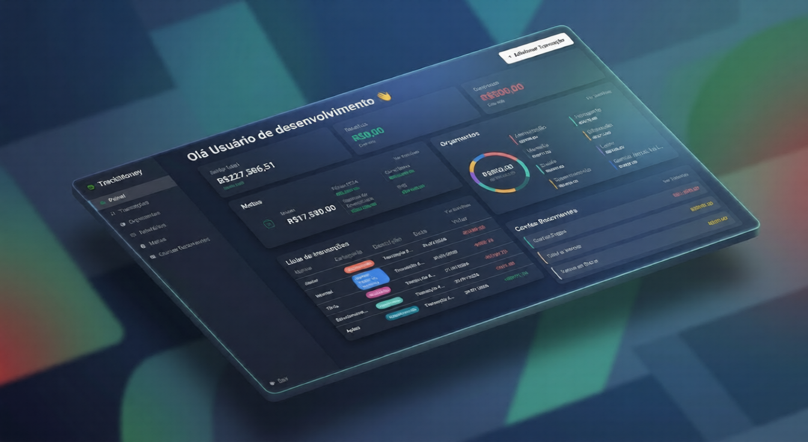
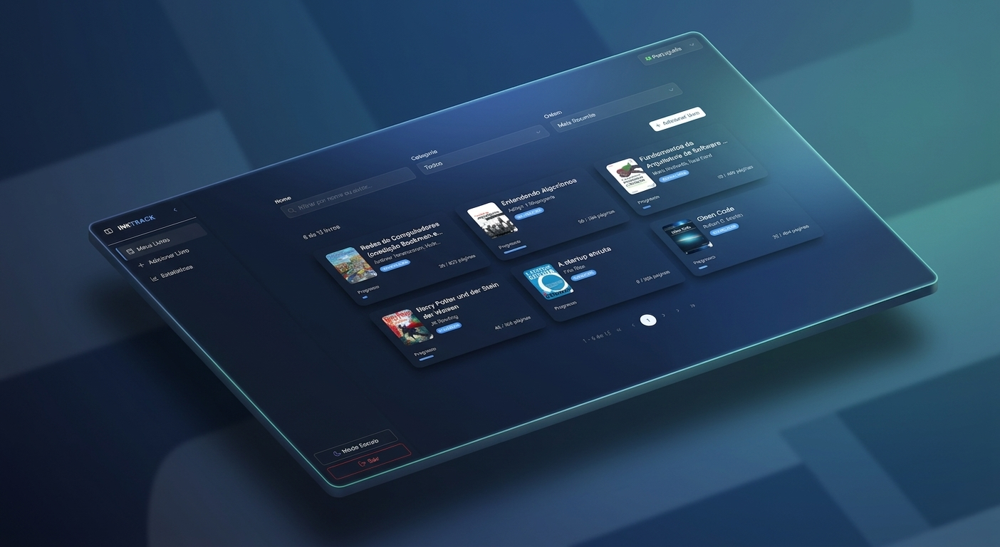

  
  
  

###

<h1 align="center">Felipe Melo 👨‍💻</h1>
<h3 align="center">Backend Developer | Java & Spring Ecosystem</h3>

###

Backend developer focused on **Java & Spring ecosystem**, building production-ready applications with clean architecture and scalable solutions. Currently deepening knowledge in distributed systems and cloud architecture (AWS).

###

### 🛠 Tech Stack

###

### 🔥 Featured Projects

<table>
<tr>
<td align="center" width="50%">

**TrackMoney** 💰
 
<em>Enterprise financial management</em>

 

 

  
  

</td>
<td align="center" width="50%">

**InkTrack API** 📚
 
<em>Reading management with Hexagonal Architecture</em>

 

 

  
  

</td>
</tr>
</table>

---

  
📊 GitHub Stats (click to expand)

  <table>
    <tr>
      <td>
        
      </td>
      <td>
        
      </td>
    </tr>
  </table>

---

### 🎵 Now Playing

  

